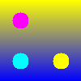
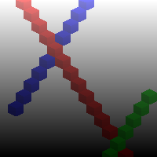
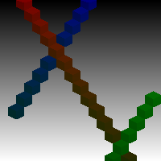
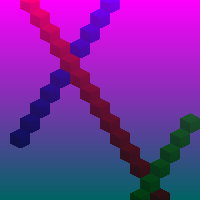

# canvas-drawer

Implements a simple drawing api

TODO: Add a representative image for your project here

## How to build

*Windows*

Open git bash to the directory containing this repository.

```
canvas-drawer $ mkdir build
canvas-drawer $ cd build
canvas-drawer/build $ cmake -G "Visual Studio 16 2019" ..
canvas-drawer/build $ start Draw-2D.sln
```

Your solution file should contain two projects: `pixmap_art` and `pixmap_test`.
To run from the git bash command shell, 

```
canvas-drawer/build $ ../bin/Debug/draw_test
canvas-drawer/build $ ../bin/Debug/draw_art
```

*macOS*

Open terminal to the directory containing this repository.

```
canvas-drawer $ mkdir build
canvas-drawer $ cd build
canvas-drawer/build $ cmake ..
canvas-drawer/build $ make
```

To run each program from build, you would type

```
canvas-drawer/build $ ../bin/draw_test
canvas-drawer/build $ ../bin/draw_art
```

## Supported primitives

Isometric Cube


Isometric Tetrahedron


Circle


## Results

Various circles with a gradient



These three variations of the image "dungeon," demonstrate how the different gradient specification work.

Background gradient from white to black, and matching block gradient



Background gradient from black to white, and block gradient from white to green



Background gradient from magenta to (0, 100, 100), and block gradient affected by background, with a gradient from white to black applied as well.



"Tarski's World"

uses isometric tetradhedron, cubes, and a background gradient


